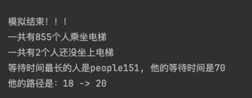
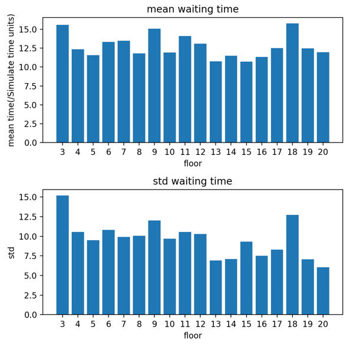
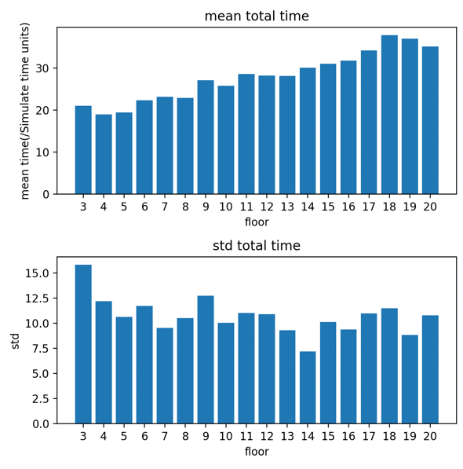
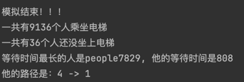
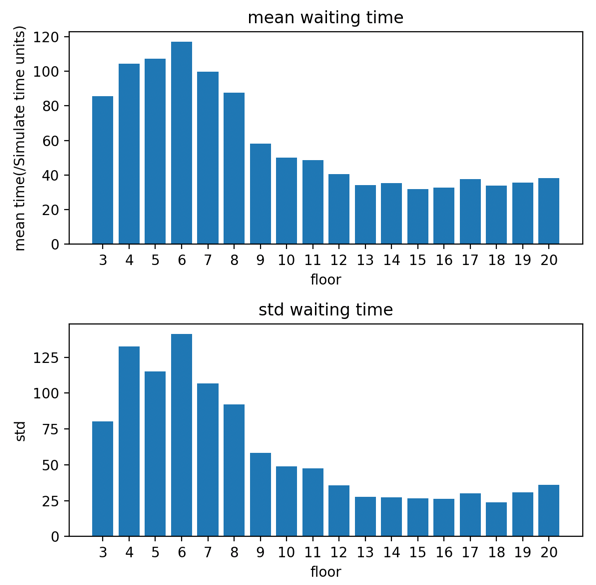
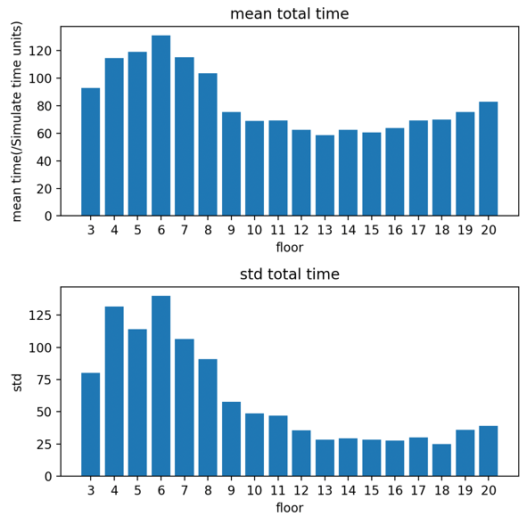

# Elevator-Simulation

Simulate elevator scheduling and analyze the average waiting time for each floor

# 模拟电梯调度

最近在好奇这样一件事情，那就是：

在某些特定时刻，如中午饭点的时候，大家都需要使用电梯，那么是处在高楼层的人等待电梯的时间长，还是低楼层的人等待电梯时间长呢？

在中午饭点时，大多数人的目的地都将是一楼，只有少数人的比例是去其他楼层。因此可以分析出以下两种情况：

1️⃣在高楼层的人会与到这样的情况：

如果自己身处19楼，并且电梯已经下去到15楼了，那么自己就需要等待电梯到达一楼后重新运行到19楼。

2️⃣在低楼层的人会遇到这样的情况：

当电梯到达自己所在的楼层时，电梯可能已经满了，那么只好等待下一个电梯的到来。而下一个电梯通常是需要先跑去高楼层再回到低楼层。

于是我决定写一个模拟算法模拟一下：

设定一楼和二楼的人可以直接走到一楼。所以可以选择不等待电梯。

设定大家选择去一楼的概率是90%

设定电梯数目为3个

设定电梯可以承载1000kg

设定楼层一共是20层

通过“generate_query_rate”这个变量的值来控制想要乘坐电梯的人数。
最后根据我自己设定的电梯调度算法，得出一下结果：

1️⃣：当乘坐电梯的请求不多的情况下，得出的结果如图1，2，3所示：

waiting time表示：用户从点击“上”或者“下”按钮到电梯门打开，所等待的时间。

total_time表示：用户从点击“上”或者“下”按钮到电梯听停到指定楼层所消耗的时间。

从图二可以看出，当请求数目正常的时候，每个楼层的等待时间几乎一致，

从图三可以看出，高楼层由于电梯运行时间长，所以需要消耗更多的时间才能到达一楼。

2️⃣：当乘坐的电梯的请求很多的情况下，得出的结果如图4，5，6所示：

可以看到，由于电梯在到达低楼层时经常是满员的状态，因此低楼层需要等待非常长的时间。

目前感觉，得到的结果还是挺符合直觉的，当然，目前的结果都与我在模拟过程中设定的电梯调度算法有关。 不同的调度算法将会产生不同的结果。
